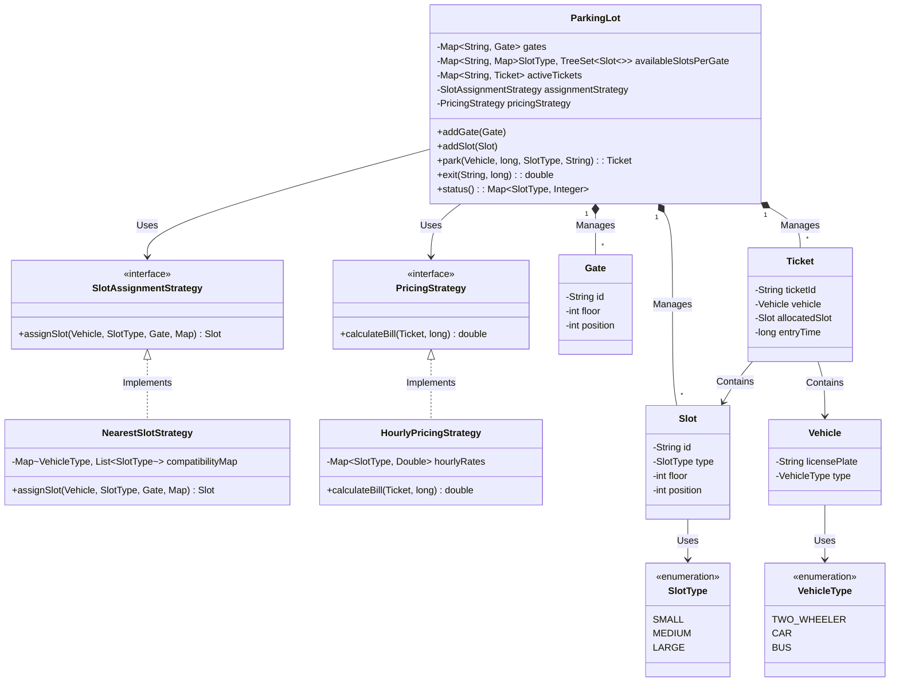

# 🅿️ Multilevel Parking Lot System (Low-Level Design)

A robust, highly scalable, and modular object-oriented design for a multilevel parking lot. This system is engineered to
handle multiple entry gates, dynamic slot assignments based on distance, vehicle type compatibility, and extensible
pricing models.

## ✨ Core Features

* **Multi-Gate Distance Optimization:** Automatically assigns the *nearest* available compatible slot based on the
  specific entry gate the vehicle arrives at.
* **Smart Slot Upgrades:** Implements compatibility rules where smaller vehicles can occupy larger slots if their
  preferred slots are full (e.g., a Two-Wheeler can park in a Medium or Large slot).
* **Fair Billing System:** Calculates parking fees based on the *allocated slot type*, not the vehicle type, ensuring
  fair usage of real estate.
* **High Performance:** Utilizes customized `TreeSet` data structures backed by Red-Black Trees. Finding the optimal slot and updating its availability across $G$ multiple gates operates at a highly efficient **$O(G \log N)$** time complexity, ensuring the system remains responsive even with thousands of parking spaces.

---

## 🏗️ Architecture & Approach

This system strictly adheres to **SOLID** principles and utilizes the **Strategy Design Pattern** to prevent the
`ParkingLot` service from becoming a bloated "God Object."

### 1. Separation of Concerns

The codebase is divided into clear layers:

* **Models (Entities):** Pure data carriers (`Vehicle`, `Gate`, `Slot`, `Ticket`).
* **Strategies (Business Logic):** Interchangeable rules for assignment and pricing.
* **Service (Orchestrator):** The `ParkingLot` class simply holds the state and delegates complex decisions to the
  injected strategies.

### 2. The Strategy Pattern

By abstracting the core logic into interfaces, the system is highly extensible (Open/Closed Principle):

* **`SlotAssignmentStrategy`**: Currently implemented as `NearestSlotStrategy`. If a future requirement demands VIP
  parking (where VIPs get premium slots regardless of distance), we simply create a `VipSlotStrategy` without modifying
  existing code.
* **`PricingStrategy`**: Currently implemented as `HourlyPricingStrategy`. This can easily be swapped for a
  `FlatRatePricingStrategy` or `SurgePricingStrategy` during holidays.

### 3. The "Nearest Slot" Engine (`TreeSet`)

Finding the nearest slot out of thousands could be an $O(N)$ bottleneck. To solve this, the system pre-computes
distances:

* Each `Gate` maintains its own `Map<SlotType, TreeSet<Slot>>`.
* The `TreeSet` is initialized with a custom `Comparator` that sorts slots by their geometric distance to *that specific
  gate* (calculating floor and position deltas).
* **Result:** When a vehicle enters, finding the optimal slot is an **$O(\log N)$** operation (`treeSet.first()`). Because we must prevent double-booking, updating this state across all $G$ gates takes **$O(G \log N)$** time.

---

## 📊 UML Class Diagram



---

## 📁 Project Structure

```text
src/
├── enums/
│   ├── SlotType.java
│   └── VehicleType.java
├── models/
│   ├── Gate.java
│   ├── Slot.java
│   ├── Ticket.java
│   └── Vehicle.java
├── strategy/
│   ├── PricingStrategy.java
│   ├── HourlyPricingStrategy.java
│   ├── SlotAssignmentStrategy.java
│   └── NearestSlotStrategy.java
├── service/
│   └── ParkingLot.java
└── Main.java
```

---

## 🚀 How to Run

1. Clone the repository to your local machine.
2. Ensure you have Java Development Kit (JDK) 8 or higher installed.
3. Compile the Java files:
   ```bash
   javac src/*.java
   ```
4. Execute the Main runner class:
   ```bash
   java -cp src Main
   ```

The `Main.java` file contains a pre-built simulation that demonstrates adding physical infrastructure (Gates and Slots), processing various vehicle arrivals (including automated slot upgrades), and calculating exits and billing.